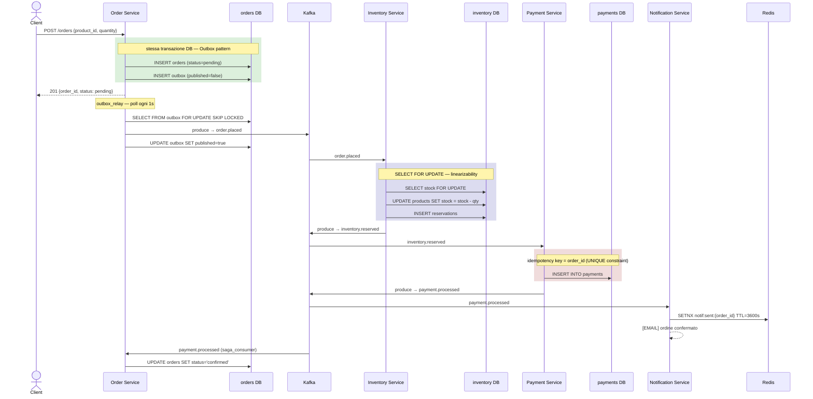
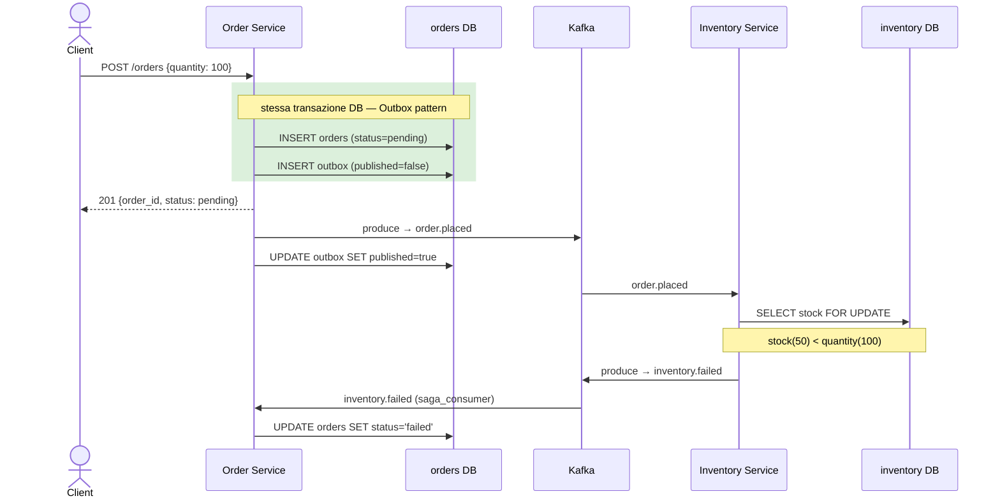
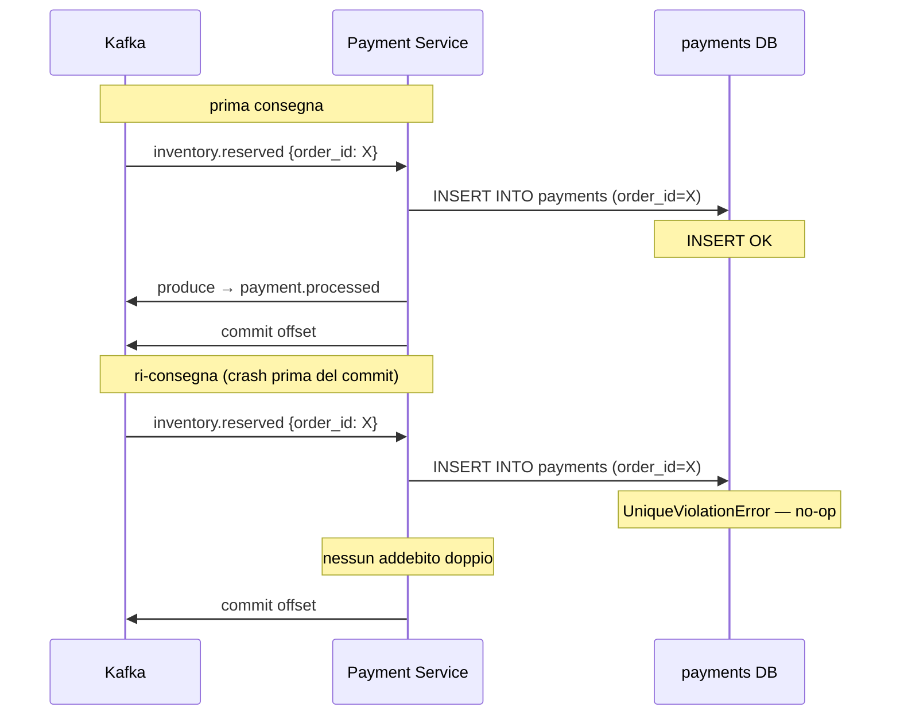

# Sistemi Distribuiti Event-Driven

Teoria e pratica per un affondo su architetture distribuite event driven e pattern di resilienza, suggerito da Claude.


## Guida teorica e progetto pratico

---

## Indice

1. [Il Teorema CAP](#1-il-teorema-cap)
2. [PACELC — L'estensione pratica del CAP](#2-pacelc--lestensione-pratica-del-cap)
3. [Kafka e il modello CP](#3-kafka-e-il-modello-cp)
4. [Algoritmo Raft](#4-algoritmo-raft)
5. [Modelli di Consistency](#5-modelli-di-consistency)
6. [Progetto Pratico — E-commerce Event-Driven](#6-progetto-pratico--e-commerce-event-driven)

---

## 1. Il Teorema CAP

Il teorema (Brewer, 2000) afferma che un sistema distribuito può garantire **al massimo 2 delle 3** proprietà:

| Proprietà | Descrizione |
|---|---|
| **C — Consistency** | Ogni lettura riceve il dato più recente scritto (o un errore) |
| **A — Availability** | Ogni richiesta riceve sempre una risposta (non necessariamente aggiornata) |
| **P — Partition Tolerance** | Il sistema continua a funzionare anche se i nodi non riescono a comunicare |

> **Il punto chiave, spesso frainteso:** P non è mai davvero opzionale in un sistema distribuito reale — le partizioni di rete *accadono*. La scelta vera è quindi tra **CP** e **AP** quando si verifica una partizione.

---

## 2. PACELC — L'estensione pratica del CAP

Daniel Abadi (2012) ha esteso il CAP per coprire il 99.9% del tempo operativo: cosa succede **in assenza di partizioni**?

```
if Partition  →  scegli tra Availability e Consistency
else          →  scegli tra Latency e Consistency
```

Il CAP parla solo degli eventi rari (partizioni). PACELC aggiunge il tradeoff quotidiano: **latenza vs consistency**.

### Perché latenza e consistency sono in conflitto

In presenza di un database replicato su 3 nodi si dispone di due strade:

**Scelta EL (bassa latenza):** si scrive sul nodo locale, si risponde subito al client, si propagano i dati ai replica in background. Risposta in ~1ms, ma una lettura immediata da un altro nodo potrebbe restituire il dato vecchio.

**Scelta EC (consistency forte):** si attende che almeno 2 nodi su 3 confermino la write (quorum). Il client attende ~10-50ms in più, ma chiunque legga da qualsiasi nodo vedrà il dato aggiornato. Questo è esattamente ciò che Raft implementa: una entry del log è committata solo dopo che la **maggioranza** dei nodi ha risposto.

### Applicazione pratica nel progetto e-commerce

| Servizio | Scelta PACELC | Motivazione |
|---|---|---|
| Inventario | PC/EC | Non è possibile oversellare. Meglio bloccare che rispondere con dati stale |
| Carrello utente | PA/EL | Un dato stale per qualche secondo è accettabile. La latenza bassa è prioritaria |
| Notifiche email | PA/EL estremo | Una notifica in ritardo di 2s non causa alcun danno |

---

## 3. Kafka e il modello CP

Kafka non gestisce lo stato applicativo come un database, ma **trasporta eventi**. Il suo posizionamento CP/AP dipende dalla configurazione del producer.

Con `acks=all` Kafka si comporta come **CP**: il producer non riceve conferma finché tutti i replica in-sync (ISR) non hanno scritto il messaggio. Zero perdita di messaggi, latenza più alta. È la configurazione indicata per sistemi finanziari o ovunque un messaggio perso costituisca un problema grave.

Con `acks=1` o `acks=0` il producer riceve conferma prima che i replica si allineino — più vicino ad AP, con rischio di perdita dati in caso di crash del leader.

Nel progetto il broker è configurato in modalità KRaft: Kafka gestisce internamente il proprio cluster metadata tramite l'**algoritmo Raft** (descritto nella sezione successiva), eliminando la dipendenza da ZooKeeper. Il `kafka-init` crea i topic esplicitamente con replication factor 1 — scelta deliberata per il laboratorio locale, non per la produzione.

---

## 4. Algoritmo Raft

Raft (Ongaro & Ousterhout, 2014) è stato progettato con un obiettivo esplicito: essere **comprensibile**. Risolve il problema fondamentale dei sistemi distribuiti: come fanno N nodi a mettersi d'accordo su una sequenza di valori, anche se alcuni nodi crashano o la rete si interrompe?

Raft scompone il problema in tre parti indipendenti:

1. **Leader Election** — quale nodo comanda in un dato momento
2. **Log Replication** — come il leader propaga le write agli altri
3. **Safety** — garanzie che il sistema non diverga mai

### Parte 1 — Leader Election

Ogni nodo parte come **follower** con un *election timeout* casuale (150–300ms). Se non riceve heartbeat entro il timeout, diventa **candidate**:

1. Incrementa il term corrente (es. 1→2)
2. Si auto-vota
3. Invia `RequestVote` a tutti gli altri nodi

Un nodo concede il voto se non ha ancora votato in questo term. Non appena il candidato raccoglie la **maggioranza** (quorum = ⌊N/2⌋ + 1), diventa **leader** e inizia a inviare heartbeat per affermare la propria leadership. Se il leader crasha, il primo follower a scadere avvia automaticamente una nuova elezione — il cluster si auto-guarisce senza intervento esterno.

### Parte 2 — Log Replication

```
Client → Leader
           │
           ├── aggiunge entry al proprio log (non committata)
           ├── invia AppendEntries a tutti i follower in parallelo
           │
           ├── attende ACK dalla maggioranza
           │
           ├── marca entry come committata
           └── risponde al client ✓
               (follower lenti si allineano al prossimo heartbeat)
```

Ogni entry è identificata da `(index, term)`. Il leader verifica sempre l'entry precedente prima di appendere (`prevLogIndex` + `prevLogTerm`). Se non coincidono, il follower rifiuta e il leader esegue rollback al punto di divergenza.

### Le tre garanzie di Safety

| Proprietà | Descrizione |
|---|---|
| **Election Safety** | Al massimo un leader per term |
| **Log Matching** | Se due log hanno la stessa entry allo stesso indice, sono identici su tutti gli indici precedenti |
| **Leader Completeness** | Un leader del term T contiene tutte le entry committate nei term precedenti |

### Collegamento al progetto

In KRaft mode, `KAFKA_CONTROLLER_QUORUM_VOTERS` definisce i nodi con diritto di voto nell'elezione Raft. In produzione si usano 3 o 5 controller per tollerare 1 o 2 failure; nel laboratorio il quorum è formato da un solo nodo — sufficiente per sperimentare, zero fault tolerance. L'esperimento della Fase 4 (`docker stop kafka`) permette di osservare direttamente cosa accade al cluster durante un failover del leader.

---

## 5. Modelli di Consistency

I modelli di consistency descrivono **cosa vede il client** dopo una write. Non descrivono *come* i nodi si sincronizzano — quello è compito di Raft e del WAL di PostgreSQL — descrivono il contratto esposto all'applicazione.

La domanda centrale è sempre la stessa: se si scrive un valore sul nodo A, quando lo vede il client che legge dal nodo B?

### Spettro dal più forte al più debole

#### Linearizability (Strong Consistency)
Ogni operazione appare istantanea e atomica. Il sistema si comporta come un singolo nodo. Una read restituisce **sempre** la write più recente, globalmente.

```
Client A:  write x=10 → ok
Client B:  legge da qualsiasi nodo → x=10 ✓ (immediatamente)
```

**Costo:** alta latenza, bassa disponibilità in caso di partizione.
**Nel progetto:** il lock `SELECT FOR UPDATE` dell'Inventory Service garantisce linearizability sulla sottrazione dello stock.

---

#### Causal Consistency
Se l'operazione B dipende causalmente da A, tutti i nodi vedono A prima di B. Operazioni non correlate possono apparire in ordini diversi.

```
Client A:  post="Ciao" → reply="Rispondo al tuo ciao"
Client B:  vede il post, poi la reply — mai al contrario ✓
```

**Costo:** implementazione complessa (vector clock o simili).
**Nel progetto:** la choreography Saga garantisce causalità tra eventi — `inventory.reserved` non può essere processato prima di `order.placed`.

---

#### Read-Your-Writes
Dopo una write, lo stesso client vede sempre il valore aggiornato nelle letture successive. Altri client possono ancora vedere il valore vecchio. Garanzia **per sessione**, non globale.

```
Client A:  write bio="Dev" → read bio="Dev" ✓
Client B:  read bio=""  (stale accettabile per altri client)
```

**Nel progetto:** PostgreSQL con connessione dedicata per servizio garantisce questa proprietà nativamente — ogni servizio legge il proprio nodo, non una replica.

---

#### Monotonic Reads
Un client non vedrà mai un valore più vecchio di quello già letto. Una volta osservato x=10, il sistema non restituirà mai più x=5 — anche leggendo da repliche diverse.

```
Client A:  read x=10 → read x=10 → read x=20 ✓
Senza garanzia: read x=10 → read x=5 ✗ (possibile con load balancer)
```

---

#### Eventual Consistency
Se le write si interrompono, tutti i nodi convergeranno eventualmente allo stesso valore. Non esiste garanzia su *quando* avvenga la convergenza né su cosa sia visibile nel frattempo. È la promessa minima che un sistema AP può offrire.

```
Client A:  write x=10
Client B:  read x=0 → read x=0 → ... → read x=10 ✓ (prima o poi)
```

**Costo:** anomalie visibili al client, richiede idempotenza nei consumer.
**Nel progetto:** il Notification Service usa Redis con questo modello — un'email duplicata o in ritardo di qualche secondo è accettabile.

> **Il tranello più comune:** eventual consistency non significa "dati sbagliati". Significa che esiste una *finestra di inconsistency* che si chiude nel tempo — tipicamente millisecondi o secondi nei sistemi moderni. Il problema emerge quando il codice assume linearizability su un sistema che garantisce solo eventual.

### Come si combinano nella pratica

I modelli non si escludono — si **impilano per operazione**. Nel progetto e-commerce:

| Operazione | Modello | Implementazione |
|---|---|---|
| Sottrazione inventario | Linearizability | `SELECT FOR UPDATE` su PostgreSQL |
| Aggiornamento profilo utente | Read-your-writes | Connessione dedicata al nodo primario |
| Notifica email | Eventual | Redis + Notification Service AP |
| Sequenza eventi Saga | Causal | Ordinamento garantito dai topic Kafka |

---

## 6. Progetto Pratico — E-commerce Event-Driven

### Obiettivo didattico

Il progetto non mira a costruire un e-commerce di produzione, ma a realizzare un **laboratorio** in cui è possibile:
- Osservare il comportamento del sistema durante una partizione di rete simulata
- Confrontare concretamente una write CP e una AP
- Sperimentare eventual consistency e idempotenza
- Implementare il Saga pattern e comprenderne la necessità

### Architettura

```
                        Client HTTP
                             │
                      Order Service
                   (CP · Outbox pattern)
                      PostgreSQL
                             │
          ┌──────────────────┼──────────────────┐
          ▼                  ▼                  ▼
    ┌───────────────────────────────────────────────────┐
    │                      Kafka                        │
    │  topics: order.placed · payment.processed         │
    │          inventory.reserved · notification.send   │
    └─────────────┬─────────────┬─────────────┬─────────┘
                  │             │             │
          Inventory         Payment      Notification
           Service           Service       Service
         (CP · FOR UPDATE) (CP · idem.)   (AP · Redis)
         PostgreSQL         PostgreSQL     Redis
```

**Saga (choreography)** — pattern che collega i tre servizi tramite eventi compensativi in caso di fallimento.

**Network partition simulator** — `docker network disconnect` per osservare il comportamento CP vs AP in tempo reale.

### Diagrammi di sequenza

#### Percorso di successo (Saga completa)



#### Percorso di fallimento (stock insufficiente)



#### At-least-once delivery e idempotency key

Kafka garantisce *at-least-once*: in caso di crash del consumer prima del commit dell'offset, il messaggio viene riconsegnato. Il Payment Service lo gestisce con una `UNIQUE constraint` su `order_id`.



### Concetti appresi per ogni componente

**Order Service + Outbox pattern**
Non è corretto eseguire `BEGIN TRANSACTION; insert order; send kafka message; COMMIT`: il message broker non partecipa alla transazione DB. L'Outbox risolve il problema scrivendo l'evento in una tabella nella *stessa transazione* del DB; un relay asincrono si occupa poi della pubblicazione su Kafka.

**Inventory Service con `SELECT FOR UPDATE`**
Il lock pessimistico garantisce che due ordini concorrenti non sottraggano lo stesso stock. È la ragione per cui il servizio è CP — linearizability applicata in concreto.

**Payment Service con idempotency key**
In un sistema AP/eventual i messaggi possono arrivare *due volte* (at-least-once delivery di Kafka). Senza idempotenza il cliente verrebbe addebitato due volte. Con l'idempotency key, la seconda esecuzione è un no-op.

**Notification Service AP**
Un'email duplicata è fastidiosa, non catastrofica. Progettare il servizio come AP elimina complessità superflua — prima dimostrazione pratica che non tutto richiede CP.

**Saga choreography**
In assenza di transazioni distribuite (il protocollo 2PC non viene utilizzato in produzione), i fallimenti si gestiscono con eventi compensativi. Se il pagamento fallisce, viene pubblicato `payment.failed` e l'inventory service rilascia lo stock riservato.

**Partition simulator**
Il concetto di partizione di rete si comprende appieno non leggendone la definizione, ma *osservando* cosa accade quando un container viene disconnesso dalla rete.

### Struttura del repository

```
ecommerce-distributed/
├── docker-compose.yml              ← Kafka, PostgreSQL x3, Redis
├── services/
│   ├── order-service/              ← Python/FastAPI
│   │   ├── main.py
│   │   ├── outbox_relay.py         ← legge outbox table e pubblica su Kafka
│   │   ├── saga_consumer.py        ← ascolta payment/inventory events e aggiorna lo status dell'ordine
│   │   └── models.py
│   ├── inventory-service/          ← Python/FastAPI
│   │   ├── main.py
│   │   └── consumer.py             ← ascolta order.placed
│   ├── payment-service/            ← Python/FastAPI
│   │   ├── main.py
│   │   └── consumer.py             ← idempotency key logic
│   └── notification-service/       ← Python/FastAPI
│       ├── main.py
│       └── consumer.py             ← eventual, AP, Redis
├── scripts/
│   ├── simulate_partition.sh       ← docker network disconnect/connect
│   └── load_test.py                ← ordini concorrenti per osservare CP vs AP
└── docs/
    └── observations.md             ← diario degli esperimenti
```

### Piano di sviluppo in 4 fasi

| Fase | Componenti | Concetti toccati |
|---|---|---|
| **1** | Docker Compose + Kafka funzionante | Setup base, topic, producer/consumer |
| **2** | Order + Inventory con Outbox | CP, transazioni, at-least-once delivery |
| **3** | Payment con idempotency + Saga | Eventual consistency, eventi compensativi |
| **4** | Partition simulator + osservazioni | CAP in pratica, PACELC vissuto |

### Comandi per fase

#### Fase 1 — Infrastruttura e Kafka

```bash
# Build di tutte le immagini dei servizi applicativi
docker compose build

# Avvia Kafka e attendi che kafka-init crei i topic
docker compose up -d kafka kafka-init

# Segui i log di init per confermare la creazione dei topic
docker compose logs -f kafka-init

# Verifica che i topic siano presenti
docker compose exec kafka kafka-topics --bootstrap-server localhost:9092 --list
```

#### Fase 2 — Order Service + Inventory Service

```bash
# Avvia i database e i due servizi
docker compose up -d postgres-orders postgres-inventory order-service inventory-service

# Controlla che tutti i container siano healthy
docker compose ps

# Piazza un ordine di test
curl -X POST http://localhost:8001/orders \
  -H "Content-Type: application/json" \
  -d '{"product_id": "abc", "quantity": 1}'
```

**Sequenza attesa nei log**

```bash
docker compose logs -f order-service inventory-service
```

```
order-service     | INFO:outbox_relay:Relay published 1 events
inventory-service | INFO:consumer:Published inventory.reserved for order <uuid>
```

**Verifica su PostgreSQL**

```bash
# Stato dell'ordine (pending → invariato in Fase 2, saga non ancora completa)
docker compose exec postgres-orders psql -U app -d orders \
  -c "SELECT id, status, created_at FROM orders ORDER BY created_at DESC LIMIT 5;"

# Outbox: published=true conferma che il relay ha inviato l'evento a Kafka
docker compose exec postgres-orders psql -U app -d orders \
  -c "SELECT topic, key, published FROM outbox ORDER BY created_at DESC LIMIT 5;"

# Inventario: la riserva è stata registrata
docker compose exec postgres-inventory psql -U app -d inventory \
  -c "SELECT order_id, product_id, quantity FROM reservations ORDER BY created_at DESC LIMIT 5;"

# Stock residuo del prodotto
docker compose exec postgres-inventory psql -U app -d inventory \
  -c "SELECT id, name, stock FROM products;"
```

#### Fase 3 — Payment Service + Notification Service (Saga completa)

```bash
# Avvia i servizi rimanenti
docker compose up -d postgres-payments redis payment-service notification-service

# Verifica che tutto lo stack sia up
docker compose ps

# Piazza un ordine e osserva l'intera catena Saga
curl -X POST http://localhost:8001/orders \
  -H "Content-Type: application/json" \
  -d '{"product_id": "abc", "quantity": 1}'
```

**Sequenza attesa nei log — percorso di successo**

```bash
docker compose logs -f order-service inventory-service payment-service notification-service
```

```
order-service        | INFO:outbox_relay:Relay published 1 events
inventory-service    | INFO:consumer:Published inventory.reserved for order <uuid>
payment-service      | INFO:consumer:Payment processed for order <uuid> (1000 cents)
notification-service | INFO:consumer:[EMAIL] Order <uuid> confirmed. Payment of €10.00 received. Thank you!
order-service        | INFO:saga_consumer:Order <uuid> → confirmed (via payment.processed)
```

**Sequenza attesa nei log — percorso di fallimento (stock insufficiente)**

```
order-service        | INFO:outbox_relay:Relay published 1 events
inventory-service    | INFO:consumer:Published inventory.failed for order <uuid>
order-service        | INFO:saga_consumer:Order <uuid> → failed (via inventory.failed)
```

**Verifica su PostgreSQL e Redis**

```bash
# Stato finale dell'ordine (confirmed o failed)
docker compose exec postgres-orders psql -U app -d orders \
  -c "SELECT id, status, created_at FROM orders ORDER BY created_at DESC LIMIT 5;"

# Riserve inventario e stock aggiornato
docker compose exec postgres-inventory psql -U app -d inventory \
  -c "SELECT order_id, product_id, quantity FROM reservations ORDER BY created_at DESC LIMIT 5;"

docker compose exec postgres-inventory psql -U app -d inventory \
  -c "SELECT id, name, stock FROM products;"

# Pagamento registrato (idempotency key = order_id, UNIQUE constraint)
docker compose exec postgres-payments psql -U app -d payments \
  -c "SELECT order_id, amount_cents, created_at FROM payments ORDER BY created_at DESC LIMIT 5;"

# Chiavi di deduplicazione notifiche in Redis (TTL 3600s)
docker compose exec redis redis-cli keys "notif:sent:*"
```

**Verifica messaggi sui topic Kafka**

```bash
# Numero di messaggi per topic (formato topic:partizione:offset)
docker compose exec kafka kafka-run-class kafka.tools.GetOffsetShell \
  --bootstrap-server localhost:9092 --topic order.placed

docker compose exec kafka kafka-run-class kafka.tools.GetOffsetShell \
  --bootstrap-server localhost:9092 --topic inventory.reserved

docker compose exec kafka kafka-run-class kafka.tools.GetOffsetShell \
  --bootstrap-server localhost:9092 --topic payment.processed

# Lag del consumer group dell'inventory (deve essere 0 se tutto è aggiornato)
docker compose exec kafka kafka-consumer-groups \
  --bootstrap-server localhost:9092 --describe --group inventory-service
```

#### Fase 4 — Partition simulator e osservazioni

```bash
# Simula una partizione sul servizio inventario
docker network disconnect ecommerce-net inventory-service

# Lancia 100 ordini concorrenti
python scripts/load_test.py --orders 100 --product-id abc --quantity 1 --concurrency 20

# Osservazioni attese:
# - Order service: risponde sempre (AP) o blocca (CP)?
# - Inventory service: quanti oversell si verificano?
# - Cosa accade quando il nodo viene riconnesso?
docker network connect ecommerce-net inventory-service
```

```bash
# Simula la morte del leader Kafka (Raft leader election in azione)
docker stop kafka

# Osservazioni attese:
# - Quanto tempo impiega il cluster a eleggere un nuovo leader?
# - Cosa riceve il producer durante il failover?
# - Gli ordini in volo vengono persi o ritrasmessi?
```

#### Teardown

```bash
# Ferma tutti i container
docker compose down

# Ferma e rimuove i volumi (azzera lo stato dei database)
docker compose down -v
```

#### Cleanup (reset dati senza riavviare)

Per ripetere un esperimento senza fermare lo stack, `cleanup.sh` svuota tutte le tabelle applicative e ripristina lo stock ai valori iniziali del seed:

```bash
./scripts/cleanup.sh
```

Cosa fa:
- **orders DB** — truncate `orders` e `outbox`
- **inventory DB** — truncate `reservations`; ripristina `products.stock` (abc → 50, xyz → 200)
- **payments DB** — truncate `payments`
- **Redis** — cancella le chiavi `notif:sent:*` usate per la deduplicazione delle notifiche

I container rimangono attivi e gli offset Kafka restano intatti — i consumer group si riallineano automaticamente al riavvio dei servizi.

### Letture consigliate

| Risorsa | Motivo |
|---|---|
| *Designing Data-Intensive Applications* — Kleppmann | Il riferimento assoluto sull'argomento. Capitoli 5, 7 e 9 sono i più rilevanti |
| *Building Event-Driven Microservices* — Bellemare | Direttamente applicabile al progetto |
| Paper originale Raft — Ongaro & Ousterhout (2014) | Denso ma accessibile; consigliata la lettura integrale |
| "CAP Twelve Years Later" — Brewer (2012) | Revisione critica del teorema da parte del suo autore |
| Blog di Martin Fowler su Event Sourcing e CQRS | Pattern che estendono naturalmente il progetto |

---

*Roadmap: CAP → PACELC → Kafka CP → Raft → Modelli di Consistency → Progetto pratico*

---

## Certificati SSL aziendali

Se `docker compose build` fallisce durante `pip install` con errori SSL (tipico dietro un proxy aziendale con ispezione HTTPS), crea una cartella `certs/` nella root del repository e inserisci il certificato CA in formato `.crt`:

```bash
mkdir certs
cp /percorso/del/tuo/certificato.crt certs/
docker compose build
```

I certificati vengono montati nei container **solo durante la fase di build** tramite BuildKit bind mount — non vengono mai copiati nelle immagini finali. La cartella `certs/` è già in `.gitignore`.
